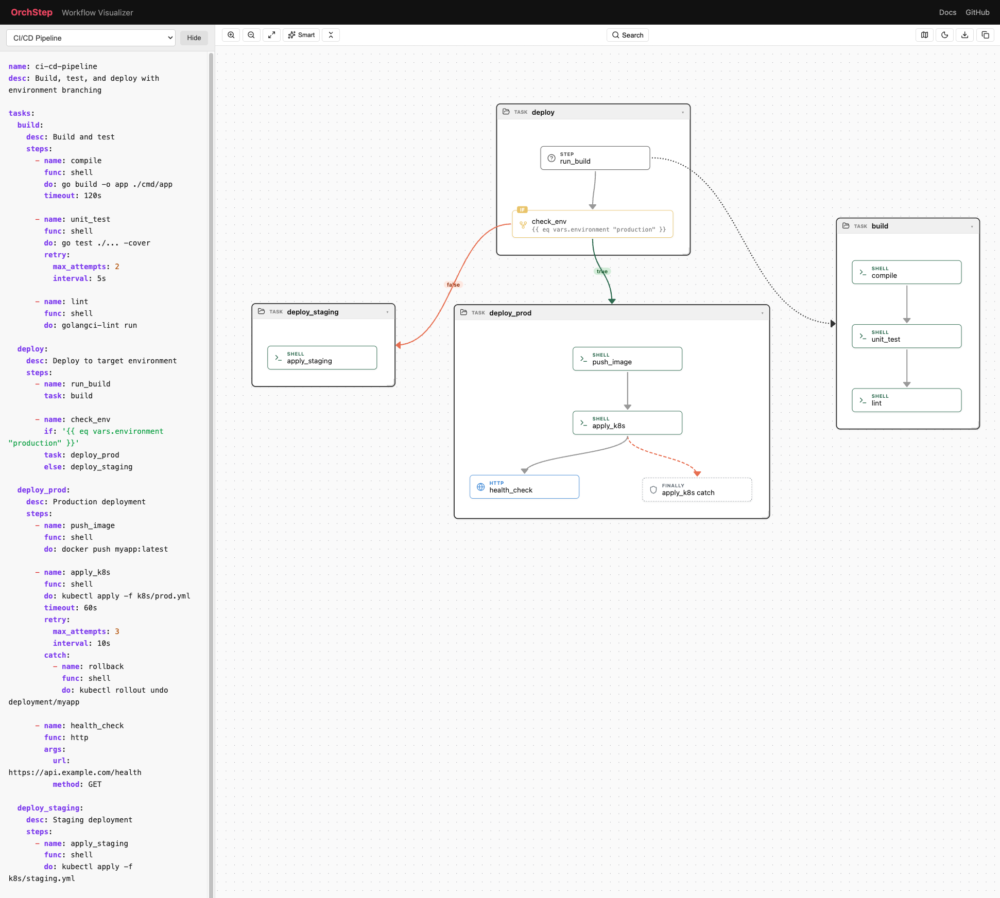
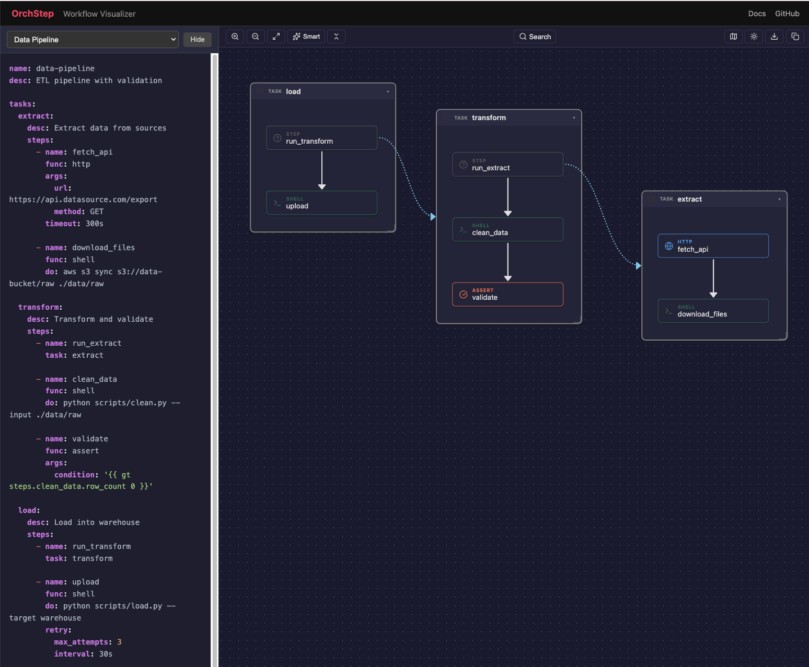

<p align="center">
  <picture>
    <source media="(prefers-color-scheme: dark)" srcset="docs/images/logo-dark.png">
    
  </picture>
</p>

# OrchStep


**YAML-first workflow orchestration engine.** Run anywhere, no vendor lock-in.

📖 **Docs & live demos:** [orchstep.dev](https://www.orchstep.dev/)

OrchStep orchestrates multi-step workflows defined in YAML. It delegates to your existing tools (terraform, kubectl, aws, docker) rather than reimplementing them.

### CI/CD Pipeline — with YAML editor and syntax highlighting



### Data Pipeline — dark mode with Smart layout



> **[Try the live Workflow Visualizer →](https://orchstep.dev/visualize)** Paste any OrchStep YAML to see it as an interactive diagram.
>
> The `@orchstep/workflow-viewer` package powers the visualizer — an interactive React component that renders OrchStep workflows as directed graphs. Features include Smart/Vertical/Horizontal layouts, dark mode, collapsible tasks, search, export to PNG, and copy to clipboard. Available at [`packages/workflow-viewer`](packages/workflow-viewer).

## 🎬 Capture agent work → replay with zero tokens

When an AI coding agent (Claude Code, Cursor, …) solves a real task for you —
running a test suite, a deploy, a multi-step shell sequence — that reasoning
costs tokens **every single time you run it**. With OrchStep you capture the
solved session **once** into a replayable `orchstep.yml`. Every run after that
executes the *same business logic* deterministically — **no LLM, no tokens, no
drift.**

For repeated testing and operational work that's **up to ~80% less agent token
spend**: the first run pays for the reasoning; every run after is just
`orchstep run`.


```bash
# In Claude Code, right after the agent finishes the task:
/orchstep-capture                       # compress the session into orchstep.yml

# Forever after — same result, no model in the loop:
orchstep run -f captured.orchstep.yml
```

> Record your test steps or shell scripts as a workflow once, and re-running the
> same logic never touches an LLM again. The [`orchstep-capture`](skills/orchstep-capture/)
> skill turns "the agent already did this once" into a permanent, shareable,
> deterministic workflow.

### 🧠 Design workflows with your agent

The [`orchstep-workflow-design`](skills/orchstep-workflow-design/) skill teaches
Claude (and any MCP-capable agent) to author **production-grade** OrchStep YAML —
real failure handling, not just the happy path. It ships dense references,
annotated examples, and a guided wizard:

- **Quick mode** — give a concrete task, get a correct workflow, no questions.
- **Wizard mode** — "help me design this" → 2–4 intent questions → a tailored workflow.

Install it from [`skills/orchstep-workflow-design/`](skills/orchstep-workflow-design/)
and your agent designs reusable workflows that are right the first time.

## Quick Start

```bash
# Install
curl -fsSL https://orchstep.dev/install.sh | sh

# Or via package managers
brew tap orchstep/tap && brew install orchstep
npm install -g orchstep
pip install orchstep

# Run a demo
cd demos/01-post-deploy-smoke-test
orchstep run

# Or pick a task interactively
orchstep menu
```

> **Interactive picker:** Run `orchstep menu` in any directory with an `orchstep.yml` to open a keyboard-driven task picker. Single-keystroke hotkeys, fuzzy search (arrow keys or `/`), and a filter cycle (`f` to cycle all → a-z → public → internal). Running plain `orchstep` in a terminal also auto-launches the menu; in a pipeline it exits cleanly instead of hanging.

## 🖥️ OrchStep Pipeline — a web dashboard for the CLI

The command line is the product. `orchstep run`, `orchstep menu`, `orchstep mcp` — that's the first-class interface: scriptable, CI-friendly, agent-friendly, no browser required.

**OrchStep Pipeline** is the *optional* companion to it — a second-class citizen by design. It's a local web dashboard you open with a single command when you'd rather click, watch, and inspect. Everything it does is an `orchstep` command underneath, and it prints the exact CLI invocation for every run, so nothing you do in the browser is locked to the browser.

```bash
orchstep serve     # -> http://127.0.0.1:7777  (one static binary, nothing else to set up)
```

Pick a task and read it as source, a resolved plan, or the full execution graph; launch it with an environment and pretty logs; watch every step light up live as the run descends into each called task; jump from a step straight to its logs; and inspect exactly what any step saw — its variables, environment, and output. Run history lives in a single SQLite file, it binds to `127.0.0.1`, and there's no infra or signup.

[](https://youtu.be/4xZm_ZmSC_g)

▶ **[Watch the 60-second tour](https://youtu.be/4xZm_ZmSC_g)** · full walkthrough at [orchstep.dev/learn/serve](https://orchstep.dev/learn/serve)

## What's in This Repo

| Directory | Contents |
|-----------|----------|
| `spec/` | OrchStep YAML language specification |
| `modules/` | Official and community module registry |
| `skills/` | LLM agent skill documents |
| `mcp/` | MCP server interface specification |
| `demos/` | Example workflows for real-world use cases |
| `docs/` | User documentation |

## Quality & Testing

The OrchStep engine is rigorously tested with a comprehensive regression suite:

| Metric | Value |
|--------|-------|
| Regression test specs | **431** |
| Pass rate | **100%** (431/431) |
| Feature categories tested | **14** (execution, variables, control flow, loops, error handling, HTTP, git, templates, environment, config, assertions, modules, data flow, advanced) |
| Platforms verified | **6** (darwin/amd64, darwin/arm64, linux/amd64, linux/arm64, windows/amd64, windows/arm64) |
| CI pipeline | Automated on every commit — build, lint, vet, unit tests, full regression suite |

Every release is gated by the full regression suite. The test infrastructure includes mock HTTP servers, mock CLI simulators, and authenticated git operation tests to ensure real-world reliability.

### What's Tested

- **Workflow execution** — task pipelines, step sequencing, shell command execution
- **Variable management** — 4-level scoping, precedence, dynamic resolution, type preservation
- **Control flow** — if/elif/else, switch/case, loops (items/count/range/until), task delegation
- **Error handling** — retry with exponential backoff + jitter, try/catch/finally, timeouts, on-error modes
- **HTTP integration** — GET/POST/PUT/DELETE, authentication (bearer/basic/API key), JSON parsing, batch requests
- **Git operations** — clone, checkout, push, fetch, branches, tags, submodules, authenticated operations
- **User prompts** — text, password, select, confirm, multiselect with non-interactive mode for CI/agents
- **Module system** — config schemas, exports, versioning, dependencies, nesting, remote git modules, lockfiles
- **Templates** — Go templates, Sprig functions, JavaScript expressions, regex extraction
- **Environment** — .env file loading, inheritance modes, groups, hierarchical configs

## The Engine

The OrchStep engine is distributed as a compiled binary. Install it using any method above, then use the spec and modules in this repo to build workflows.

## Distribution

| Channel | Install Command |
|---------|----------------|
| **curl** | `curl -fsSL https://orchstep.dev/install.sh \| sh` |
| **Homebrew** | `brew tap orchstep/tap && brew install orchstep` |
| **npm** | `npm install -g orchstep` |
| **pip** | `pip install orchstep` |
| **Docker** | `docker pull orchstep/orchstep:latest` |
| **GitHub Action** | `uses: orchstep/setup-orchstep@v1` (install) / `uses: orchstep/run-orchstep@v1` (one-step run) |

All channels pull binaries from [GitHub Releases](https://github.com/orchstep/orchstep/releases).

| Directory | Contents |
|-----------|----------|
| `homebrew/` | Homebrew formula (auto-updated by GoReleaser) |
| `npm/` | npm wrapper package |
| `pip/` | pip wrapper package |
| `docker/` | Docker image configuration |
| `action/` | GitHub Action for CI/CD |

## For LLM Agents

OrchStep is designed for AI agent integration:

- **CLI:** `orchstep run task --format json` for structured output
- **MCP Server:** `orchstep mcp serve` for native tool_call integration
- **Skills:** Install skill documents from `skills/` to teach agents OrchStep patterns — including [`orchstep-capture`](skills/orchstep-capture/) (turn a solved session into a replayable, zero-token workflow) and [`orchstep-workflow-design`](skills/orchstep-workflow-design/) (author production-grade workflows)
- **Prompts:** Interactive input for humans, auto-skipped for CI/agents with `ORCHSTEP_NON_INTERACTIVE=true`

## Cross-Platform

OrchStep runs on Linux, macOS, and Windows:

- **Default shell:** POSIX `sh` — works on Alpine, distroless, all Linux/macOS
- **Go-native shell:** Set `type: "gosh"` for Windows support without bash
- **Explicit shells:** `bash`, `zsh`, `pwsh` available as opt-in

## Module Registry

OrchStep has a tiered module ecosystem:

- `@orchstep/*` — Official modules maintained by the OrchStep team
- `@community/*` — Verified community contributions
- `@ai/*` — LLM-generated modules (auto-validated)

Browse available modules in the `modules/` directory or search with:
```bash
orchstep module search deploy
```

## Contributing

We welcome module contributions from humans and AI agents! See [CONTRIBUTING.md](CONTRIBUTING.md).

## License

Open content in this repo (spec, modules, skills, demos, docs) is licensed under Apache 2.0.
The OrchStep engine binary has a separate [proprietary license](https://orchstep.com/license).
